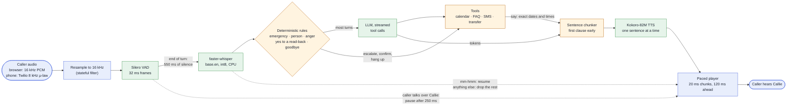
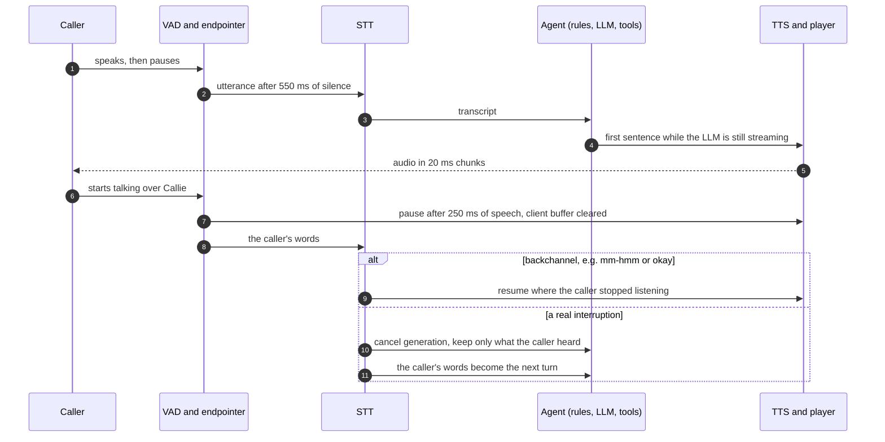

# Callie: an AI voice receptionist that answers calls, books appointments and hands off to a human

**A real-time voice agent for small service businesses. It picks up phone and browser calls, answers questions from the business's own knowledge base, books, moves and cancels appointments in the real calendar after reading the details back, and transfers the caller to a person when it should. Speech runs locally on CPU; the language model is any OpenAI-compatible endpoint, Anthropic, or free OpenRouter models.**

[](https://github.com/gelevanog/ai-voice-receptionist/actions/workflows/ci.yml)


RESULTS_PLACEHOLDER

## What problem it solves

A dental practice, a garage or a salon misses calls all the time: after hours, at lunch, while the front desk is with a patient. Most people who reach voicemail do not leave a message; they call the next business on the list. Every missed call is a lost booking.

Callie answers every call, day and night. It says up front that it is an AI assistant and that the call may be recorded, answers questions about hours, prices, insurance, parking and services from the business's own information, and books, reschedules or cancels appointments in the business's real calendar. It never invents an opening: times come only from the calendar, and nothing is booked until Callie has read the name, service, date and time back and the caller has said yes. When a call needs a person (an emergency, an upset caller, a request for the front desk, or a conversation that is going in circles) it transfers the call, or takes a message when nobody is in. Confirmations go out by text.

The demo business is **Brightside Dental**, a fictional clinic in New York time. Every name, number and appointment in this repository is made up.

## Features

- **Real-time voice pipeline** (Python, FastAPI, WebSockets, asyncio), streamed at every stage:
  - **voice activity detection** with Silero VAD (ONNX, 32 ms frames) and **endpointing** that ends the caller's turn after 550 ms of silence (configurable; the latency/turn-taking trade-off is measured below);
  - **speech to text** with faster-whisper `base.en` (int8, CPU), chosen by measuring `tiny.en`, `base.en` and `small.en` on this machine;
  - **LLM with tool calling**, streamed; text is cut into sentences as it arrives and the **first clause goes to TTS before the answer is complete**;
  - **text to speech** with Kokoro-82M (ONNX, CPU, Apache-2.0 voice), one sentence at a time;
  - **barge-in**: when the caller talks over Callie, playback pauses within ~250 ms of speech; a **backchannel** ("mm-hmm", "okay") resumes it, anything else drops the rest of the answer, cancels generation and keeps only the words the caller actually heard in the conversation history;
  - **turn-taking**: utterances spoken while Callie is still thinking are merged into one turn; a filler ("One moment.") plays when the model is slow; **silence prompts** ("Are you still there?") and a polite hang-up.
- **Telephony**
  - **Browser calls** (the demo): microphone in an AudioWorklet (16 kHz PCM16), playback with a 120 ms buffer that is cleared instantly on barge-in, live transcript, tool calls and a per-turn **latency waterfall**.
  - **Twilio Media Streams**: TwiML webhook with signature validation, bidirectional WebSocket with base64 G.711 μ-law at 8 kHz, click-free stateful resampling, `clear` on barge-in, `mark` messages, DTMF "0 for a person", transfer by updating the live call with `<Dial>` TwiML. Tested with recorded message fixtures; see the honest note under [Connect a Twilio number](#connect-a-twilio-number).
- **Agent and tools**: `check_availability`, `book_appointment`, `find_appointment`, `reschedule_appointment`, `cancel_appointment`, `answer_faq` (BM25 retrieval over the clinic's Markdown knowledge base), `take_message`, `transfer_to_human`, `send_confirmation_sms` (Twilio SMS; dry-run outbox without credentials), `end_call`.
- **Calendar** in SQLite (SQLAlchemy 2.0, Postgres-ready): business hours, lunch break, holidays, service durations, two resources (hygienist, dentist), conflicts per resource, minimum notice, booking horizon, demo seed data. Optional **Google Calendar connector** (Calendar API v3): busy times block slots, bookings are mirrored as events; tested against a mocked API.
- **Safety and reliability, enforced in code, not only in the prompt**
  - **Read-back and a yes before any change**: the first `book/reschedule/cancel` call returns a deterministic read-back; a confirmed call succeeds only if the details match and the caller's very next turn was a clear yes. A plain "yes" executes the action without another model call.
  - **Availability only from tools**: booking accepts only slot ids that `check_availability` offered in the same call; the calendar re-checks the slot inside a lock. Dates and times the caller hears are spoken by code, not paraphrased by the model.
  - **Deterministic date and time normalization** ("next Tuesday after lunch", "a week from Friday", "half past nine", "the 21st") in the clinic's timezone, DST-safe, with its assumptions reported and read back.
  - **Escalation rules** before the model: emergencies (911 advice, then transfer), requests for a person, anger, repeated misunderstanding; after hours a transfer becomes a message.
  - **No medical, legal or financial advice**: an output filter replaces sentences with doses, drug names or diagnoses before they are spoken.
  - **AI and recording disclosure** in the greeting.
  - **Minimal personal data**: names and phone numbers live only in the appointment row; transcripts, tool logs, call records, the dashboard and the evaluation artifacts hold masked forms (`M**** G*******`, `***-***-8839`).
  - **Speech-recognition realities**: fuzzy name lookup ("Sophia Rossi" finds "Sofia Rossi"), phone numbers re-asked digit by digit when the transcript does not hold 10 digits.
- **Dashboard** (FastAPI + Jinja2, no build step): live call page, call history with transcripts, tool calls, latency and stereo recordings, the appointment calendar, the evaluation page.
- **Providers**: `openrouter` (free models by default, with a **free-only guard** that refuses any model id without `:free` and rejects an answer served by a non-free model), `openai` (or any OpenAI-compatible server such as a local Ollama), `anthropic` (official SDK), and `fake` (a deterministic rule-based receptionist) so tests, CI and the demo run with zero keys and zero downloads. Real calls go through retries with backoff, model fallback, a disk cache, a call budget and a call ledger.

## How it works

**The real-time pipeline.** Every stage streams into the next; the dotted lines are barge-in.



**One turn, and an interruption.** The player never holds more than 120 ms of audio on the client, so "stop talking" takes effect at once, and it knows how much of each sentence the caller heard.



**The call flow with tools and escalation.**


DETAILED_RESULTS_PLACEHOLDER

## Quick start

**1. Zero keys, zero downloads** (fake speech components and a rule-based fake model):

```bash
uv sync                    # Python 3.12
make serve                 # http://localhost:8000
make call                  # or talk to the agent as text in the terminal
make test                  # the test suite, no keys, no downloads
```

Open http://localhost:8000 and press **Start call**. In this mode the "speech recognizer" hears the next line of a demo script each time you speak, and Callie's voice is a tone; you can also type. Everything else is the real pipeline: VAD (energy-based), turn-taking, barge-in, tools, the calendar and the dashboard.

**2. Real local speech, still no keys** (Silero VAD, faster-whisper, Kokoro on your CPU; the fake model decides):

```bash
uv sync --all-extras       # adds faster-whisper, kokoro-onnx, onnxruntime (and piper-tts for the evaluation)
make models                # Silero VAD, Kokoro-82M, faster-whisper base.en, a Piper caller voice (~0.6 GB, once)
make serve-real            # talk to Callie in your browser with real speech recognition and synthesis
```

**3. With a real LLM** (free OpenRouter models; the free-only guard is on by default):

```bash
export OPENROUTER_API_KEY=sk-or-...
uv run callie models free --smoke 3        # free models today + a tool-calling smoke test of three
CALLIE_LLM_PROVIDER=openrouter CALLIE_LLM_MODEL=inclusionai/ling-3.0-flash-sante:free make serve-real
```

Any OpenAI-compatible server works too (`CALLIE_LLM_PROVIDER=openai`, `OPENAI_BASE_URL=http://localhost:11434/v1` for a local Ollama), and so does Anthropic (`CALLIE_LLM_PROVIDER=anthropic`, `ANTHROPIC_API_KEY`, default `claude-sonnet-5`). To use paid OpenRouter models, set `CALLIE_REQUIRE_FREE_MODELS=false` deliberately.

**Simulated calls and the evaluation**:

```bash
make simulate              # one simulated caller through audio, scripted (no API calls)
make eval                  # all scenarios with an LLM caller (needs OPENROUTER_API_KEY; ~80 minutes, real time)
make eval-wer eval-bargein report
```

**Docker:**

```bash
docker compose up --build                                   # http://localhost:8000, fake components by default
docker compose run --rm callie callie download-models       # once, for the real speech stack (models volume)
```

The image (`EXTRAS=voice` by default) contains the speech runtimes but no model weights; they are downloaded into a volume by `callie download-models`, or baked in with `--build-arg BAKE_MODELS=true`. Set the variables of [Configuration](#configuration) in `.env`.

## Connect a Twilio number

1. Run Callie where Twilio can reach it over HTTPS, for example `make serve-real` plus `ngrok http 8000`, and set `CALLIE_PUBLIC_BASE_URL=https://<your-tunnel>`.
2. In the Twilio console, set the number's **A call comes in** webhook to `POST https://<your-tunnel>/twilio/voice`.
3. Set `CALLIE_TWILIO_ACCOUNT_SID`, `CALLIE_TWILIO_AUTH_TOKEN` (requests are rejected unless their `X-Twilio-Signature` is valid), `CALLIE_TWILIO_FROM_NUMBER` (sender of confirmation texts) and `CALLIE_TRANSFER_NUMBER` (where transfers dial).

The webhook answers with `<Connect><Stream url="wss://…/twilio/media">` and passes the caller's number as a stream parameter, so returning patients are found by caller ID and are not asked for their number. Audio arrives as 20 ms base64 μ-law frames at 8 kHz, is resampled to 16 kHz for VAD and Whisper, and Callie's speech goes back the same way; barge-in sends `clear`. A transfer updates the live call with `<Say>…</Say><Dial>+1…</Dial>` TwiML through the REST API.

**Honest note:** no live Twilio call was made while building this (no Twilio account was used). The message shapes follow Twilio's Media Streams documentation and are tested with a recorded fixture (`tests/fixtures/twilio/`), the webhook signature is checked against values computed with Twilio's official Python helper library, and the REST calls are tested against a mock. The "phone line" condition of the evaluation passes every caller utterance through the same 8 kHz μ-law codec path.

## Connect Google Calendar

Set `CALLIE_GOOGLE_CALENDAR_ID` and `CALLIE_GOOGLE_ACCESS_TOKEN` (for example from a service account the calendar is shared with; token refresh is left to the deployment). Busy times from Google then block slots (a Google error makes Callie offer no slot rather than risk a double booking), and every booking, reschedule and cancellation made by Callie is mirrored as an event with the patient's initials. Tested against a mocked Calendar API; no live Google account was used.

## Configuration

Runtime settings are environment variables with the `CALLIE_` prefix; [`.env.example`](.env.example) documents every one. The business itself (hours, services, durations, resources, holidays) is a YAML file plus a Markdown knowledge base: copy [`src/callie/clinic/`](src/callie/clinic) and point `CALLIE_CLINIC_FILE` at your copy.

| Variable | Default | Purpose |
|---|---|---|
| `CALLIE_LLM_PROVIDER` / `_MODEL` / `_FALLBACK_MODELS` | `fake` / provider default / `[]` | `fake`, `openrouter`, `openai`, `anthropic`; model id; fallback list |
| `CALLIE_REQUIRE_FREE_MODELS` | `true` | refuse non-`:free` OpenRouter ids and answers served by non-free models |
| `OPENROUTER_API_KEY`, `OPENAI_API_KEY` + `OPENAI_BASE_URL`, `ANTHROPIC_API_KEY` | unset | provider credentials |
| `CALLIE_STT_PROVIDER` / `_STT_MODEL` | `fake` / `base.en` | `whisper` for faster-whisper |
| `CALLIE_TTS_PROVIDER` / `_TTS_VOICE` / `_TTS_SPEED` | `fake` / `af_heart` / `1.05` | `kokoro` (agent voice) or `piper` |
| `CALLIE_VAD_PROVIDER` / `_VAD_THRESHOLD` | `energy` / `0.5` | `silero` for Silero VAD |
| `CALLIE_ENDPOINT_SILENCE_MS` | `550` | silence that ends the caller's turn |
| `CALLIE_BARGE_IN_MIN_SPEECH_MS` / `_HARD_INTERRUPT_MS` | `250` / `1200` | pause after this much caller speech; interrupt without waiting for STT after this much |
| `CALLIE_FILLER_AFTER_MS` / `_SILENCE_PROMPT_SECONDS` / `_FAST_CONFIRM` | `1800` / `9` / `true` | filler, "are you still there?", rule-based confirmation |
| `CALLIE_CLINIC_FILE` / `_DATABASE_URL` / `_NOW` | packaged demo / `sqlite:///data/callie.db` / real time | business config, database, frozen clock for demos |
| `CALLIE_PUBLIC_BASE_URL`, `CALLIE_TWILIO_*`, `CALLIE_TRANSFER_NUMBER` | unset | telephony |
| `CALLIE_GOOGLE_CALENDAR_ID` / `_ACCESS_TOKEN` | unset | Google Calendar mirror |
| `CALLIE_LLM_MAX_CALLS` / `_MAX_RETRIES` / `_CACHE_DIR` / `_LEDGER` | `420` / `3` / `.cache/llm` / `results/calls.jsonl` | budget, retries, cache and ledger of real calls |

| Endpoint | Description |
|---|---|
| `WS /ws/call` | browser call: binary PCM16 both ways, JSON events (transcript, tools, latency, barge-in) |
| `POST /twilio/voice`, `WS /twilio/media` | Twilio webhook (TwiML) and Media Streams WebSocket |
| `GET /`, `/calls`, `/calls/{id}`, `/calendar`, `/eval` | dashboard: live call, history, call detail with recording, calendar, evaluation |
| `GET /api/calls`, `/api/appointments`, `/health`, `/docs` | JSON API, health (models present, stack), OpenAPI |

## Project structure

```text
src/callie/
├── audio/            # PCM helpers, G.711 μ-law codec, streaming resampler, phone-line and noise simulation
├── vad/              # Silero VAD (ONNX) and an energy VAD; the endpointer (speech start / ongoing / end of turn)
├── stt/              # faster-whisper (CPU, int8) and a scripted fake
├── tts/              # Kokoro-82M and Piper (ONNX) and a tone fake; the streaming sentence chunker
├── llm/              # OpenRouter / OpenAI-compatible (SSE), Anthropic (SDK), fake receptionist, free-only guard,
│                     #   retries + fallback + cache + budget + ledger
├── agent/            # tools and their rules, escalation and confirmation policies, grounding check, prompt, turn logic
├── scheduling/       # spoken date/time normalization, calendar with conflicts, database models, Google Calendar
├── kb/               # BM25 over the Markdown knowledge base
├── pipeline/         # the call session (VAD -> STT -> agent -> TTS, barge-in, latency), paced player, recorder
├── transports/       # browser WebSocket, Twilio Media Streams + webhook, Twilio REST (SMS, transfer)
├── web/              # FastAPI app, dashboard templates, the browser client (AudioWorklet microphone, playback)
├── eval/             # scenarios, LLM caller, real-time line simulator, checks, WER and barge-in benchmarks, report
├── clinic/           # the demo business: clinic.yaml + knowledge base
├── privacy.py        # masking of names and phone numbers
└── cli.py            # callie serve | call | simulate | eval | models | calls | download-models | db
tests/                # unit, integration (WebSocket + Twilio fixtures) and real-time session tests; no keys, no downloads
results/              # committed evaluation artifacts and the call ledger
docs/                 # screenshots, demo calls (audio + transcripts)
```

## Key design decisions

**Stream at every stage, because callers hear latency as rudeness.** A turn is a chain: wait for the caller to finish, transcribe, think, speak. Done one after the other on a CPU with a free-tier model, the gaps add up to many seconds of dead air. So the endpointer hands over the utterance the moment the silence threshold passes, the LLM streams, the chunker releases the first clause as soon as it is complete ("Sure, let me check that,"), TTS synthesizes one sentence while the next is still being generated, and the player starts on the first 20 ms chunk. The per-turn waterfall on the live page shows where each turn's time went, so tuning is measurement, not guesswork.

**Local STT and TTS, a swappable LLM.** Speech runs on the clinic's own CPU: no per-minute speech bills, no audio sent to third parties, and it works with any LLM. The models were chosen by measuring on this machine: `base.en` transcribed a ~2 s utterance in ~0.3 s with almost the same clean-speech accuracy as `small.en` (which is ~3x slower but holds up better in noise); Kokoro-82M sounds far more natural than Piper at a real-time factor of ~0.25, and its int8 export was ~4x *slower* than fp32 here. The language model is the part worth paying for in production, so it is a setting: free OpenRouter models for this project, any OpenAI-compatible server, or Claude.

**Dates and confirmations are code, not model output.** Language models are confident and wrong about calendars: in the smoke test, `liquid/lfm-2.5-2.6b:free` turned "next Tuesday afternoon" into "Tuesday, October 12, 2027" by itself. Callie's model never computes a date. It passes the caller's words to `check_availability`, a deterministic parser resolves them in the clinic's timezone (DST included) and reports how it understood them, and the read-back is generated by code from the database row that will be written. Nothing is written until the caller's very next reply is a clear yes, and a plain "yes" is handled by a rule, which also saves a model round trip.

**Tool results are the only source of availability.** A receptionist that offers a time that is not free is worse than one that offers nothing. The model can only book a slot id that `check_availability` returned in the same call, the calendar re-checks it inside a lock, and the sentences the caller hears about times come from the tool's `say` text. The evaluation counts every clock time the model said on its own and every attempt to book something that was not offered.

**Escalate early, and by rules.** An emergency, a caller who wants a person, an angry caller or a conversation that keeps failing should reach a human fast, without depending on a model noticing. Those checks run on every transcript before the model sees it; emergencies get 911 advice first; after hours a transfer becomes a message with a callback time. Medical, legal and financial advice is filtered from the model's sentences before they are spoken.

**Barge-in in two stages.** Stopping at the first sound would let every "mm-hm", cough or background voice cut Callie off; waiting for the transcript would talk over the caller for a second. So playback pauses as soon as there is 250 ms of speech, and the transcript decides: a backchannel resumes where it paused, anything else drops the rest of the answer and keeps only what the caller heard in the history, so the model does not believe it said things the caller never heard.

**Limits, measured and stated.** CPU speech recognition and free-tier models are slow next to GPU or hosted streaming STT and a dedicated LLM: the end-of-turn silence alone is 550 ms, and free-tier queueing makes the model's first token the largest stage. Whisper is the weak link for names and phone numbers spoken digit by digit, especially on a noisy phone line; Callie re-asks and reads numbers back, but DTMF or caller ID is the reliable path. The evaluation's callers are synthetic voices and LLM-written lines, not real people with accents, hesitations and background noise, so treat the success rate as a regression benchmark, not a promise.

## Testing

```bash
make test    # TESTS_COUNT tests, no API keys, no model downloads
make lint    # ruff check, ruff format --check, mypy --strict
```

| Suite | What it covers |
|---|---|
| `test_audio.py` | μ-law against the reference codec on all 65,536 samples, streaming resampler (chunk-size independent, no boundary clicks), WAV, noise at a target SNR, phone band |
| `test_vad.py` | endpointing on synthetic signals: onset and end timing, short pauses vs. turn ends, clicks, chunk-size independence, max utterance, noise floor; Silero when downloaded |
| `test_timeparse.py` | 80 cases of spoken dates and times, ambiguity and assumptions, past dates, other timezones, DST (US and EU) |
| `test_calendar.py` | hours, lunch, durations, holidays, horizon, conflicts per resource, slot spreading, reschedule/cancel, DST storage, Google Calendar (mocked) |
| `test_agent.py` | the read-back/yes gate in every order, offered-slots-only booking, caller ID, unclear phone numbers, reschedule with an STT-misspelled name, FAQ grounding, transfer open/closed, masking, escalation rules, backchannels, medical-advice filter, sentence streaming, interrupted history |
| `test_providers.py` | free-only guard (ids, fallbacks, served model), SSE with tool-call deltas, error mapping, retries + fallback + ledger + cache + budget, Anthropic conversion, fake model |
| `test_session.py` | the live session with fake components in real time: a booking over audio, AI disclosure, barge-in, backchannel, silence prompts and hang-up, emergency transfer, merged turns |
| `test_web.py`, `test_twilio.py` | the browser WebSocket end to end, dashboard pages; Twilio webhook signature and TwiML, a recorded Media Streams call, outbound framing and `clear`, REST transfer and SMS (mocked) |
| `test_eval_cli.py` | WER and its normalizer, percentiles, the scenario file, report rendering, CLI smoke |

CI ([`.github/workflows/ci.yml`](.github/workflows/ci.yml)) runs lint and mypy, the tests, a CLI booking with the fake model, a scenario-file check and a Docker build, without keys or model downloads. The real-model numbers come from the CLI runs described above, not from CI.

## Roadmap

Not implemented yet:

- Streaming STT with partial transcripts and semantic end-of-turn detection (a model that knows "and…" is not the end), to cut the 550 ms silence wait without cutting callers off.
- A GPU or hosted STT/TTS option for production latency, and a faster first token from a dedicated (paid or self-hosted) model; free-tier queueing dominates the numbers below.
- DTMF entry for phone numbers and dates of birth, and reminder calls/texts the day before.
- A live Twilio test number in CI (needs an account), outbound calls, call recording consent per jurisdiction.
- Multi-location and multi-provider scheduling with provider preferences; patient identity verification before changes.
- Postgres row locking for multi-process deployments (one process with an in-process lock today).

## License

[MIT](LICENSE) © 2026 Ivan Savchenko. Third-party models and libraries keep their own licenses:

| Component | Used for | License |
|---|---|---|
| [Silero VAD](https://github.com/snakers4/silero-vad) v6 (ONNX) | voice activity detection | MIT |
| [faster-whisper](https://github.com/SYSTRAN/faster-whisper) + Whisper `base.en` weights | speech to text | MIT (code and weights) |
| [Kokoro-82M](https://huggingface.co/hexgrad/Kokoro-82M) via [kokoro-onnx](https://github.com/thewh1teagle/kokoro-onnx) | Callie's voice | weights Apache-2.0, kokoro-onnx MIT |
| eSpeak NG (via `phonemizer` / `espeakng-loader`, and inside Piper) | phonemization for both TTS engines | GPL-3.0 |
| [Piper](https://github.com/OHF-Voice/piper1-gpl) `piper-tts` + `en_US-libritts_r-medium` voice | simulated callers in the evaluation only (optional `piper` extra) | GPL-3.0; voice trained on LibriTTS-R (CC BY 4.0), fine-tuned from Piper's lessac voice |

The speech runtimes are optional extras and the model weights are downloaded separately, not distributed with this repository.
